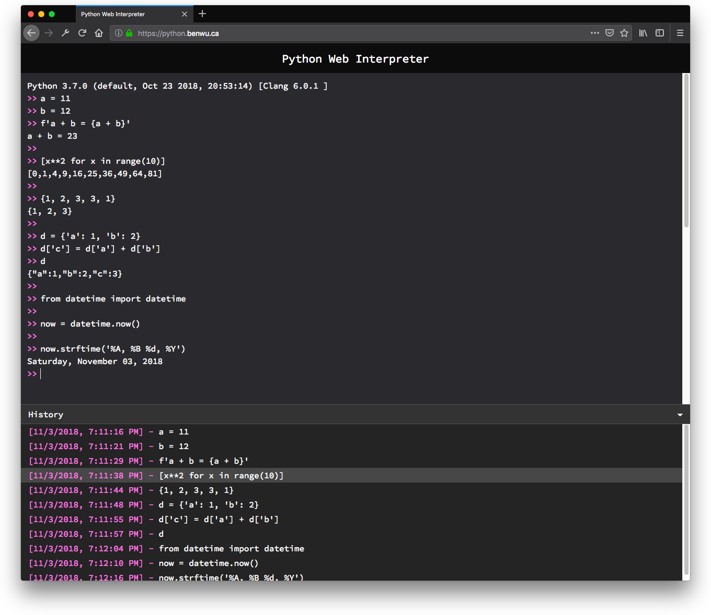

# Python Web Interpreter 

[](https://travis-ci.org/Ben-Wu/python-web-interpreter)

Python interpreter running in the browser using [Pyodide](https://github.com/iodide-project/pyodide)

This is a static web app built with React

Try it [here](https://python.benwu.ca)



### Development

#### Setup

```sh
git clone https://github.com/Ben-Wu/python-web-interpreter.git
yarn
```

#### Start dev server
```sh
yarn start
```
Server runs on `http://localhost:8080`

#### Make build
```sh
yarn build
```
Output will be in `/dist`